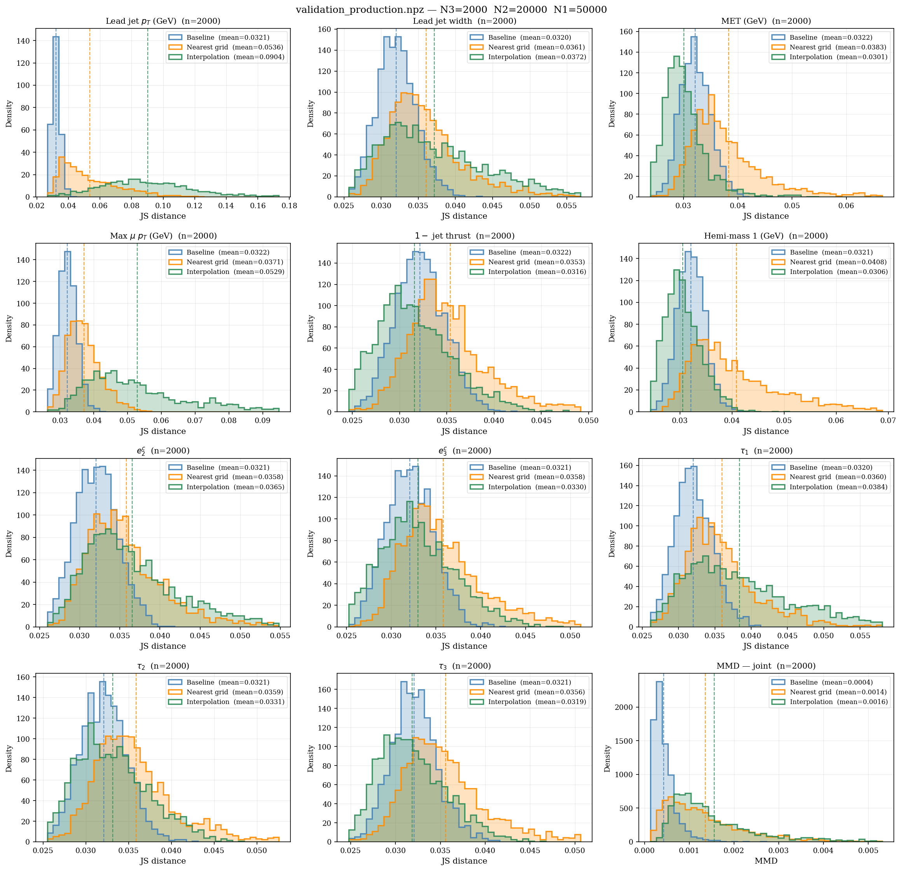
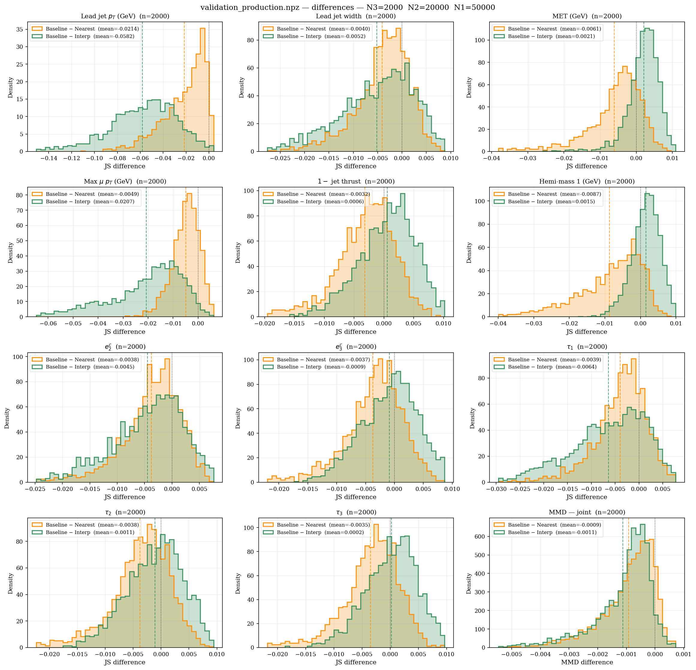
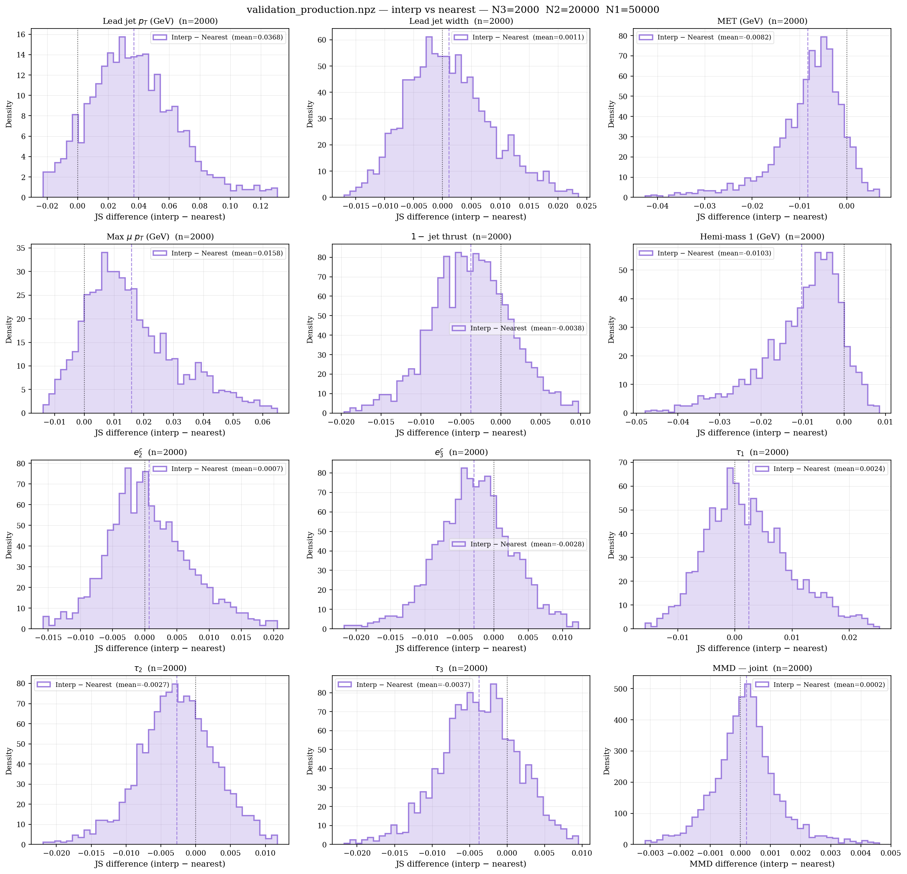

# Validation

Three scripts quantify how well the scan model reproduces PYTHIA truth, in a natural order of increasing cost and rigor.

---

## When to run which script

| Script | Input | PYTHIA calls | What it answers |
|--------|-------|-------------|-----------------|
| `validate_fit.py` | single TSV | none | Are my transforms and distributions a good fit? |
| `validate_grid.py` | scan NPZ + binary | 2 × N3 | Does the interpolation work at all? |
| `validate_production.py` | scan NPZ + binary | 3 × N3 | How much better is the model than just using the nearest grid point? |

The intended order is: run `validate_fit.py` to finalise observable choices → run a scan → run `validate_grid.py` to check interpolation quality → run `validate_production.py` on the finalised scan.

---

## Script 1 — `validate_fit.py`

**What it does.** Fits the transform pipeline and marginal distribution to all valid events in a single TSV. Draws N1 independent marginal samples from the fitted model. Computes Jensen-Shannon (JS) distance for two comparisons:

- `js_fit` — model samples vs a disjoint evaluation subset of the data (N2 events)
- `js_baseline` — two other disjoint evaluation subsets compared against each other (statistical noise floor)

Note: the fit is performed on **all** valid events, including the evaluation subsets. This is not a held-out test — it measures whether the chosen parametric family can represent the data at all (in-sample fit quality), which is the right question at this stage. With 3–4 parameters per observable there is no meaningful overfitting risk.

If `js_fit ≈ js_baseline`, the fit is as good as the data will allow at this sample size. If `js_fit >> js_baseline`, the transform or distribution choice is a poor match for the observable's shape, and you should look into changing the transformations/distributions supplied for your observable.

The model samples are drawn independently per observable (no copula), so this validates only marginal fit quality, not joint structure.

**Requirements.** At least 3 × N2 valid events in the TSV (after range-check filtering).

```bash
python src/run_regression/validate_fit.py \
    simulated/tsv/jets_default.tsv \
    --obs "leadVisPt,MET,tau1,tau2,tau3" \
    --N1 50000 --N2 5000 --bins 80 \
    --out simulated/svj/validation_fit.npz
```

**Output NPZ.**

| Key | Shape | Description |
|-----|-------|-------------|
| `js_fit` | `(n_obs,)` | JS distance: model vs truth |
| `js_baseline` | `(n_obs,)` | JS distance: two truth halves (noise floor) |
| `obs_names` | `(n_obs,)` | observable names |
| `fitted_params` | `(total,)` | flat fitted parameter vector |
| `param_offsets` | `(n_obs+1,)` | start indices into `fitted_params` |
| `N1, N2, bins` | scalars | run settings |

---

## Script 2 — `validate_grid.py`

**What it does.** Samples N3 random interior points uniformly in grid-index space (so every grid cell gets equal coverage regardless of whether axes are linear or log spaced). At each point:

1. Runs PYTHIA twice with N2 events each → `truth_1`, `truth_2`.
2. Interpolates the model at the point; draws N1 samples.
3. Computes per-observable JS distance:
   - `js_baseline` — JS(`truth_1`, `truth_2`): statistical noise floor
   - `js_interp` — JS(`model`, `truth_1`): interpolation quality

No nearest-grid comparison; no MMD. This is the right script to run after a rough scan to decide whether the interpolation is working before spending time on a denser grid.

**Requirements.** Completed scan NPZ with co-located `svj_scan_meta.json`; compiled binary.

```bash
python src/run_regression/validate_grid.py \
    simulated/svj/svj_scan.npz \
    --N1 50000 --N2 5000 --N3 20 \
    --n-workers 4 \
    --out simulated/svj/validation_grid.npz
```

**Output NPZ.**

| Key | Shape | Description |
|-----|-------|-------------|
| `js_baseline` | `(N3, n_obs)` | JS(`truth_1`, `truth_2`) per point |
| `js_interp` | `(N3, n_obs)` | JS(`model`, `truth_1`) per point |
| `obs_names` | `(n_obs,)` | |
| `axis_names` | `(K,)` | |
| `val_scan_params` | `(N3, K)` | scan-axis values at each validation point |
| `val_frac_idxs` | `(N3, K)` | fractional grid indices |
| `N1, N2, N3, bins` | scalars | |

---

## Script 3 — `validate_production.py`

**What it does.** Full production benchmark. Same structure as `validate_grid.py` but adds:

- A third PYTHIA run at the **nearest evaluated grid point** per validation point, giving a direct comparison to the naive "just use the closest pre-computed point" alternative.
- **MMD** (Maximum Mean Discrepancy with RBF kernel) for the joint distribution of all observables together, capturing inter-observable correlations that per-marginal JS misses.

Three comparisons for both JS and MMD:

| Comparison | JS key | MMD key | Interpretation |
|------------|--------|---------|----------------|
| `truth_1` vs `truth_2` | `js_baseline` | `mmd_baseline` | statistical noise floor |
| `model` vs `truth_1` | `js_interp` | `mmd_interp` | interpolation quality |
| `nearest PYTHIA` vs `truth_1` | `js_nearest` | `mmd_nearest` | nearest-grid alternative |

If `mmd_interp < mmd_nearest`, the interpolation is beating the naive alternative. If both are close to `mmd_baseline`, the model is near the statistical limit.

**Requirements.** Finalised scan NPZ; compiled binary. Each validation point requires 3 PYTHIA runs, so total PYTHIA calls = 3 × N3.

```bash
python src/run_regression/validate_production.py \
    simulated/svj/svj_scan.npz \
    --N1 50000 --N2 5000 --N3 30 \
    --n-workers 4 --n-mmd 2000 \
    --out simulated/svj/validation_production.npz
```

**Output NPZ.**

| Key | Shape | Description |
|-----|-------|-------------|
| `js_baseline` | `(N3, n_obs)` | JS(`truth_1`, `truth_2`) |
| `js_interp` | `(N3, n_obs)` | JS(`model`, `truth_1`) |
| `js_nearest` | `(N3, n_obs)` | JS(`nearest PYTHIA`, `truth_1`) |
| `mmd_baseline` | `(N3,)` | MMD(`truth_1`, `truth_2`) |
| `mmd_interp` | `(N3,)` | MMD(`model`, `truth_1`) |
| `mmd_nearest` | `(N3,)` | MMD(`nearest PYTHIA`, `truth_1`) |
| `obs_names` | `(n_obs,)` | |
| `axis_names` | `(K,)` | |
| `val_scan_params` | `(N3, K)` | scan-axis values at validation points |
| `val_frac_idxs` | `(N3, K)` | fractional grid indices |
| `nearest_scan_params` | `(N3, K)` | scan-axis values of nearest grid points |
| `N1, N2, N3, bins, n_mmd` | scalars | |

---

## Metrics

### Jensen-Shannon distance

JS distance is in [0, 1]. It is finite even when one distribution has zero mass in a bin (unlike KL divergence), and is symmetric. Values close to 0 indicate near-identical marginals; values near 1 indicate completely disjoint distributions.

Bin edges are set from the combined [0.5, 99.5] percentile range of both samples to avoid domination by rare tails.

### MMD

Maximum Mean Discrepancy with an RBF kernel measures distance between the *joint* distributions of all observables. Bandwidth is set by the median heuristic on the combined sample. Both sets are subsampled to `--n-mmd` rows before kernel computation (default 2000) so runtime is O(n_mmd²). MMD = 0 for identical distributions; larger values indicate greater divergence.

---

## Plotting results

`src/diagnostics.py` provides three plot families for visualising the output of
`validate_production.py`.  Each family has a `plot_*` variant (returns the
figure) and a `show_*` variant (calls `plt.show()` — prefer this in notebooks
to avoid double-rendering).

---

### 1 — Raw JS / MMD distributions — `show_validation`

```python
import sys; sys.path.insert(0, 'src')
from diagnostics import show_validation, plot_validation

show_validation('simulated/svj/validation_production.npz')

fig = plot_validation('simulated/svj/validation_production.npz', bins=50)
fig.savefig('validation.pdf', bbox_inches='tight')
```

One panel per observable plus a final MMD panel.  Each panel overlays three
histograms across the N3 validation points:

| Colour | Comparison | Key |
|--------|-----------|-----|
| Blue   | Baseline  JS(truth₁, truth₂)   | statistical noise floor |
| Orange | Nearest grid  JS(nearest, truth₁) | naive alternative |
| Green  | Interpolation  JS(model, truth₁)  | what the scan model achieves |

Dashed vertical lines and legend entries show the per-population mean.

**How to read:** Green ≈ Blue → near statistical limit (ideal). Green < Orange
→ interpolation beats the naive alternative (primary success criterion). Green
> Orange → interpolation is adding error; consider a denser grid or different
transform choices.

**This example:** From the written report, showing both better fitted observables (MET, Cluster mass 1, jet thrust) and some less-well fitted ones (leading jet pT, maximum muon pT).



---

### 2 — Baseline-minus comparisons — `show_validation_diff`

```python
from diagnostics import show_validation_diff, plot_validation_diff

show_validation_diff('simulated/svj/validation_production.npz')

fig = plot_validation_diff('simulated/svj/validation_production.npz', bins=50)
fig.savefig('validation_diff.pdf', bbox_inches='tight')
```

Same layout as above, but each panel shows two histograms of *differences*
rather than raw distances:

| Colour | Quantity |
|--------|----------|
| Green  | Baseline − Interp  (JS_baseline − JS_interp)   |
| Orange | Baseline − Nearest (JS_baseline − JS_nearest)  |

A dotted black line marks zero.  **Positive** values mean the comparison is
closer to truth than the statistical noise floor; **negative** values mean it
is farther.  The interpolation is doing well when the green distribution sits
to the right of the orange one.



---

### 3 — Interpolation vs nearest-grid — `show_interp_vs_nearest`

```python
from diagnostics import show_interp_vs_nearest, plot_interp_vs_nearest

show_interp_vs_nearest('simulated/svj/validation_production.npz')

fig = plot_interp_vs_nearest('simulated/svj/validation_production.npz', bins=50)
fig.savefig('interp_vs_nearest.pdf', bbox_inches='tight')
```

One histogram per panel (purple) showing `JS_interp − JS_nearest` across the
N3 validation points (and the MMD equivalent for the joint panel).  A dotted
black line marks zero.

- **Negative** → interpolation outperforms the nearest-grid alternative for
  that validation point.
- **Positive** → the nearest-grid point is closer to truth.

This is the most direct view of whether the interpolation adds value over the
naive baseline.




---

## Notes and limitations

- **Interior-only sampling.** Validation points are sampled strictly between grid nodes. Points near grid boundaries are not tested; interpolation accuracy there is expected to be lower.
- **Parallelism.** Scripts 2 and 3 use `ProcessPoolExecutor` with fork (Linux). Each worker runs independently and writes to `/tmp` using task-unique filenames.
- **Seeds.** Consecutive PYTHIA calls at the same parameter point use different `seed_offset` values (incremented by task), ensuring statistically independent samples.
- **MMD subsampling.** MMD is biased when computed on a subsample, but the bias is the same across all three comparisons (baseline, interp, nearest), so the relative ordering is reliable.
- **`vis_jet_pt_min`, `jets_vis_only`, `dijet_only`.** These are not part of the scan config and are not written to the per-point cfg. The binary uses its compiled defaults for them — the same defaults used during the original scan, so the validation conditions match.
